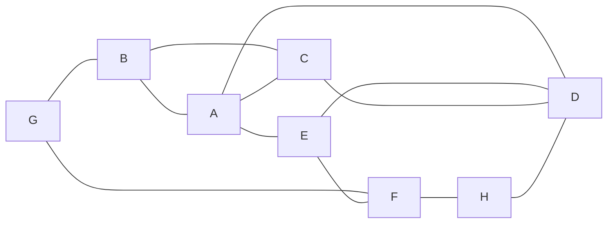

# al**go**s

Module, respectively collection of go packages concerning data structures and related *al**go***rithms.

## Data Structues

Currently implemented are

* Stack (LIFO)
* Ring Buffer (FIFO)
* Linked List
* Heap
* Graph

### Stack

```go
// Create stack and initially push some elements -> 10 on top
s := stack.NewStack(1, 2, 3, 4, 5, 6, 7, 8, 9, 10)
s.Push(20)             // pushes 20 on top of the stack
fmt.Println(s.Pop())   // pop top element (ouputs 20)
fmt.Println(s.Peek(0)) // peek on top element without removing it from stack (outputs 10)
// Output:
// 20
// 10
```

### Ring Buffer (FIFO)

```go
// Creates ring buffer (FIFO) with fixed capacity of 5 elements
r := ringbuffer.NewRingBufferWithFixedCapacity[int](5)
// Push 5 elements into the ring buffer
r.Push(1, 2, 3, 4, 5)
r.Push(6) // pushing another element 6 drops element 1, because ring buffer is full
for r.Len() > 0 {
  fmt.Printf("%v ", r.Pop())
}
// Output: 2 3 4 5 6
```

### Linked List (singly linked)

```go
// Create lists l1, l5, l6 - NewElement() returns the lists' head elements
l1 := linkedlist.NewElement(1, 2, 3, 4)
l5 := linkedlist.NewElement(5)
l6 := linkedlist.NewElement(6, 7, 8, 9)
// link them together
l5.InsertBefore(l1)
l5.InsertAfter(l6)
// Output the whole list starting from l1, which is now the head of the whole linked list
next := l1
for i := 1; next != nil; i++ {
  fmt.Printf("%v,", next.Data)
  next = next.Next()
}
// Output: 1,2,3,4,5,6,7,8,9,
```

### Heap

```go
// Create new heap with providing an appropricate less function and the heap's inital elements
h := heap.NewMaxHeap(func(a int, b int) bool { return a < b }, 10, 20, 15, 12, 40, 25, 18, 19)
fmt.Println(h.Peek()) // In a max heap the first element is always the biggest
fmt.Println(h.Sort()) // Sort the heap's slice. This method breaks the heap
h.Heapify()           // Heapify repairs the heap's order e.g. after calling Sort method
h.Push(99)
// Pop all elements until heap is empty
for e := h.Pop(); h.Len() > 0; e = h.Pop() {
  fmt.Printf("%v,", e)
}
// Output:
// 40
// [10 12 15 18 19 20 25 40]
// 99,40,25,20,19,18,15,12,
```

### Graph


